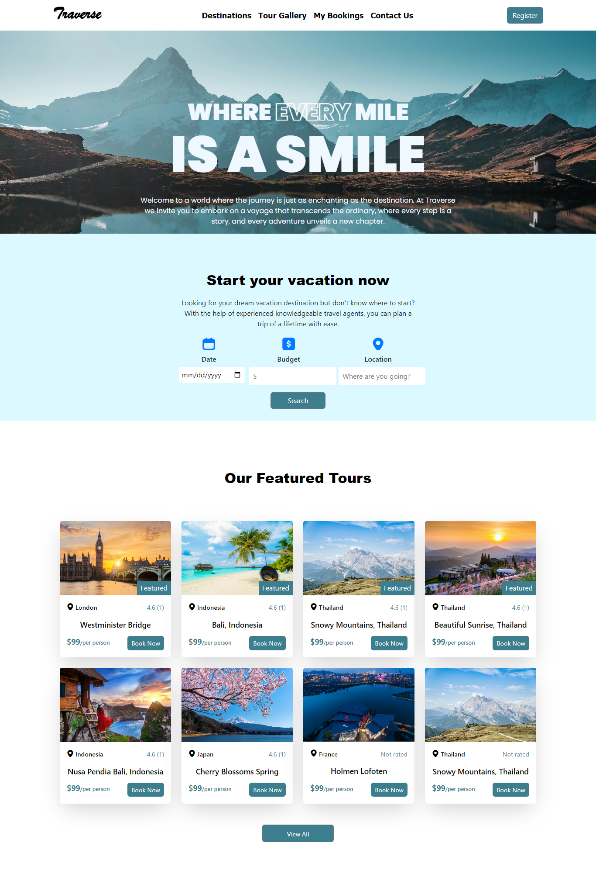

# Traverse-MERN

## Overview
**Traverse** is an advanced web application built using the MERN stack (MongoDB, Express.js, React.js, Node.js) that helps users find the perfect travel destinations within their budget. By entering their budget, number of days, and location preferences, users can explore tailored travel packages and destinations, making trip planning easy and hassle-free.

---

## Features
### 1. **User-Friendly Interface**
- A sleek and interactive frontend with real-time filters for destinations.
- Easy navigation with a responsive design.

### 2. **Personalized Travel Suggestions**
- Users can input:
  - **Budget**: Specify the maximum amount for the trip.
  - **Number of Days**: Get tailored packages based on trip duration.
  - **Location Preferences**: Explore destinations in specific regions.

### 3. **Destination Details**
- View top destinations with ratings, descriptions, and images.
- Filter by featured destinations and user reviews.

### 4. **Booking System**
- Book directly from the app.
- Dynamic price calculations based on user preferences.

### 5. **Integration**
- MongoDB for storing destination details, user data, and booking history.
- RESTful API to fetch destinations and manage user bookings.

---

## Technology Stack
### **Frontend**
- **React.js**: Dynamic and interactive user interfaces.
- **CSS/Bootstrap**: Styled components for a professional look.

### **Backend**
- **Node.js** with **Express.js**: RESTful API to handle data fetching and user requests.

### **Database**
- **MongoDB**: Stores destination information, user data, and booking details.

### **Additional Tools**
- **JWT Authentication**: Secure user login and registration.
- **Axios**: Fetching API data seamlessly.

---

## Screenshots
### **Homepage**


---

## Installation and Setup

### 1. Clone the Repository
   git clone https://github.com/Nouman-Amjad/Traverse-MERN.git
   cd Traverse-MERN

---

## Set Up the Backend

1. Navigate to the `backend` directory:
   ```bash
   cd backend
2. Install dependencies:
   ```bash
   npm install
3. Set up environment variables:
- Create a .env file in the backend directory and add:
   ```bash
   PORT=5000
   MONGO_URI=your_mongodb_connection_string
   JWT_SECRET=your_secret_key

4. Start the server:
   ```bash
   npm start

---

## Set Up the Frontend

1. Navigate to the `frontend` directory:
   ```bash
   cd ../frontend
2. Install dependencies:
   ```bash
   npm install
3. Start the React development server:
   ```bash
   npm start

## How It Works

1. **Search Destinations**:
   - Enter your trip details (budget, days, and location).
   - Explore personalized travel packages.

2. **View Details**:
   - Check ratings, reviews, and detailed descriptions of destinations.

3. **Book Your Trip**:
   - Select your desired package and proceed with booking.

---

## File Structure

### **Frontend**
- `src/components`: Contains reusable components (e.g., destination cards, filters).
- `src/pages`: Pages like Home, Destination Details, and Bookings.
- `src/styles`: CSS and styling files.

### **Backend**
- `routes/destinationRoutes.js`: Handles API endpoints for destinations.
- `models/Destination.js`: MongoDB schema for storing destination details.
- `controllers/destinationController.js`: Business logic for fetching and filtering data.

### **Assets**
- Images and other media used in the application.

---

## Future Enhancements

- Add payment integration for secure online bookings.
- Introduce AI-based recommendations for destinations.
- Implement user reviews and feedback for destinations.
- Develop a mobile app version for broader accessibility.

---

## Acknowledgments

This project was developed as part of a personal initiative to simplify travel planning. Special thanks to the MERN community for their resources and tools.

---

## License

This project is licensed under the [MIT License](LICENSE).
